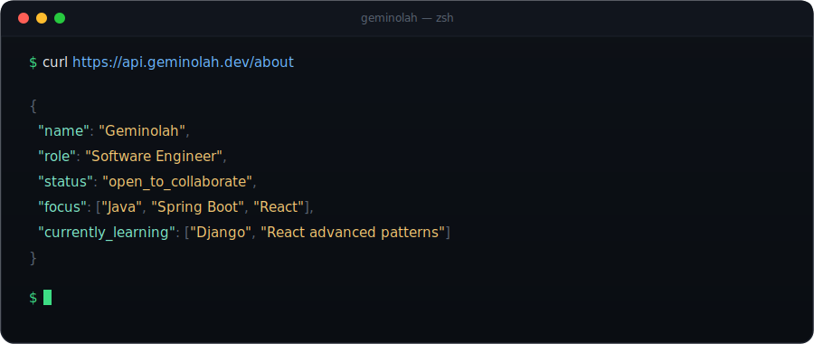

<h1 align="center">Hi 👋, I'm Geminolah</h1>
<h3 align="center">A passionate Software Developer & Computer Science Student</h3>

<p align="center">
  
</p>

<p align="center">
  <a href="mailto:geeemmanuel1702@gmail.com"></a>
  <a href="https://linkedin.com/in/your-linkedin"></a>
  <a href="https://github.com/gracemmanuel"></a>
</p>

---

### 🧑‍💻 About Me

- 🎓 Computer Science student with a strong foundation in software engineering principles
- 💻 Focused on **Java**, **Spring Boot**, **React**, **TypeScript**, and **Angular**
- 🌱 Currently deep-diving into **Django** and advanced **React** patterns
- 🔭 Building a **Cervical Cancer Vaccination Management System** — a health-tech platform aimed at improving vaccination tracking and outreach
- 📚 Passionate about **Software Development**, **Data Science**, and using tech for social impact
- ⚡ Fun fact: I enjoy turning messy real-world problems into clean, maintainable systems

---

### 🛠️ Tech Stack

<p align="center">
  <strong>Languages</strong><br>
  
  
  
  
</p>

<p align="center">
  <strong>Frameworks & Libraries</strong><br>
  
  
  
  
</p>

<p align="center">
  <strong>Databases & Tools</strong><br>
  
  
  
  
  
</p>

---

### 📊 GitHub Stats

<p align="center">
  
  
</p>

<p align="center">
  
</p>

<p align="center">
  
</p>

---

### 🔭 Current Focus

| Project | Status | Stack |
|---|---|---|
| Cervical Cancer Vaccination Management System | 🚧 In Progress | Java, Spring Boot, React, MySQL |
| Django + React Learning Track | 📖 Learning | Django, React, REST APIs |

---

### 🤝 Let's Connect

<p align="center">
  <a href="mailto:geeemmanuel1702@gmail.com">Email</a> ·
  <a href="https://linkedin.com/in/your-linkedin">LinkedIn</a> ·
  <a href="https://github.com/gracemmanuel">GitHub</a>
</p>

<p align="center">
  
</p>

<p align="center"><i>"Code is like humor. When you have to explain it, it's bad." — Cory House</i></p>

<div align="center">



<sub>base url: <code>https://github.com/Geminolah</code> · uptime: still compiling · latency: depends on the coffee</sub>

</div>

<br>

### `GET /skills` · `200 OK`

```json
{
  "languages": ["Java", "TypeScript", "JavaScript", "Python"],
  "frameworks": ["Spring Boot", "React", "Angular", "Django"],
  "databases": ["MySQL", "PostgreSQL"],
  "tools": ["Docker", "Linux", "Git"]
}
```

### `GET /projects/current` · `200 OK`

```json
{
  "name": "Cervical Cancer Vaccination Management System",
  "status": "in_development",
  "stack": ["Java", "Spring Boot", "React", "MySQL"],
  "goal": "Improve vaccination tracking and outreach for healthcare providers"
}
```

### `POST /contact` · `202 Accepted`

```json
{
  "channel": "email",
  "address": "geeemmanuel1702@gmail.com",
  "note": "queued — average response time within 24h"
}
```

<br>

### Changelog

```
v1.0.0       declared CS major, learned core programming fundamentals
v2.0.0       shipped first Java + Spring Boot projects
v2.5.0       added React + TypeScript to the stack
v3.0.0       building: Cervical Cancer Vaccination Management System
v3.1.0-beta  learning Django, deepening React patterns   ← you are here
```

<br>

<div align="center">

```
$ echo "thanks for stopping by" && open mailto:geeemmanuel1702@gmail.com
```

</div>
